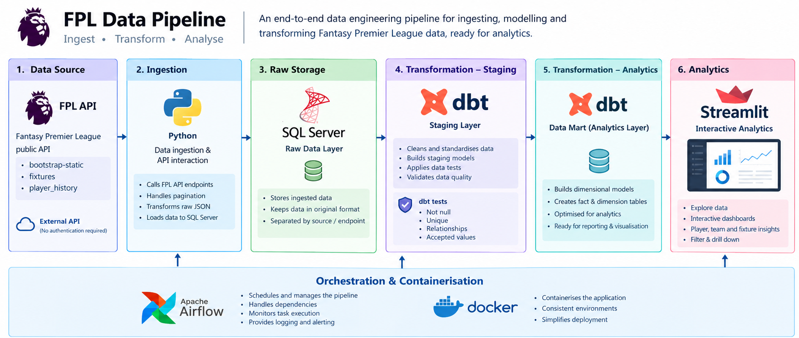
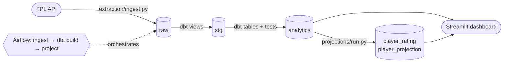

# Fantasy Premier League Data Pipeline

[](https://github.com/gw383/fpl-pipeline/actions/workflows/ci.yml)

An end-to-end data engineering project that ingests Fantasy Premier League (FPL) data from the public API, models it into a tested dimensional warehouse, projects every player's expected points for the weeks ahead, and serves it all through an interactive analytics dashboard.

I built this to work through the problems a real data pipeline has to solve — incremental ingestion, idempotent loads, orchestration, data modelling and testing — on a dataset I genuinely care about, which gave me a familiar "business problem" to reason about while developing my engineering and analytical skills.



## Highlights

- **Incremental, idempotent ingestion** — only gameweeks that are new or still being corrected by FPL are re-fetched; every partition is replaced inside a single transaction, so reruns and overlapping runs can never duplicate or lose data.
- **Layered dbt project** — `raw → stg → analytics`, 22 models with documentation and data tests (keys, relationships, accepted values), an incremental fact table and reusable macros.
- **An expected-points projection model** — team attack/defence ratings, opponent-adjusted open-play xG/xA rates with shrinkage, penalties modelled as a role for designated takers, priors from previous seasons and prices, and a minutes/availability model combine into predicted FPL points for every fixture. It is **backtested** against actual points and beats form-based baselines. [Methodology and results →](docs/rating_methodology.md)
- **Orchestrated with Airflow in Docker**, plus one-click desktop launchers.
- **Six-page Streamlit dashboard** — player deep dives, head-to-head comparisons, team form, leaderboards and a personal FPL squad view.
- **CI** — linting, unit tests and `dbt parse` on every push.

## Tech stack

| Layer | Technology |
|---|---|
| Ingestion | Python (requests, pandas, SQLAlchemy) |
| Storage | Microsoft SQL Server |
| Transformation & testing | dbt (dbt-sqlserver, dbt_utils) |
| Modelling | Python (pandas, NumPy): projection model and backtest |
| Orchestration | Apache Airflow 3 on Docker Compose |
| Reporting | Streamlit, Plotly |
| Quality | pytest, Ruff, GitHub Actions |

## How it works



**1. Extraction** ([`extraction/`](extraction)) pulls six endpoints: `bootstrap-static` (players, teams, positions, gameweeks), `fixtures`, per-gameweek live stats, and — for configured managers plus any looked up in the dashboard — profiles, gameweek picks and transfers. It also loads goal events from the Premier League's match API (premierleague.com), the only source that says which goals were penalties; player and team codes match FPL's, so the two join directly. Once a season it loads every player's previous Premier League seasons (FPL's `element-summary` history), plus the previous two seasons' goal events, for the model's history prior.

- Live stats are loaded **incrementally**: a gameweek is only re-fetched if it is new, not yet marked `data_checked` by FPL, or one of the two most recent gameweeks (a grace window for late stat corrections).
- Season-partitioned tables are replaced with a **delete-and-insert inside one transaction**; manager tables are replaced one manager at a time, the same way.
- A pooled HTTP session retries transient API failures with back-off; `pyodbc`'s `fast_executemany` batches inserts.

**2. Transformation** ([`transformation/`](transformation)) is a dbt project:

- `stg_*` views restrict each raw table to the current season (via a `seasons` seed and the `join_current_season` macro) and standardise names and types.
- `analytics` builds dimensions (`players`, `teams`, `gameweeks`) and facts (`fixtures`, `player_stats`, `player_points`, `team_gameweek_stats`, `team_fixture_results`, manager tables).
- `player_points` re-implements FPL's scoring rules per category and is **incremental**, rebuilding only recent gameweeks.

See [docs/data_model.md](docs/data_model.md) for the lineage and schema diagrams.

**3. Projection model** ([`projections/`](projections)) predicts every player's FPL points for each fixture in the next five gameweeks and writes `player_rating`, `player_projection` and `team_rating` back to the warehouse, plus `player_gameweek_expected` (what it expected from each player in every gameweek already under way, for expected-vs-actual on the team sheet). The model is pure pandas/NumPy with unit tests, and the same code powers a point-in-time **backtest** (`python projections/backtest.py`). See the [methodology](docs/rating_methodology.md).

**4. Orchestration** ([`airflow/`](airflow)) runs the daily DAG `ingest → dbt deps → dbt build → project` in Docker; `dbt build` interleaves tests with models so bad data stops downstream builds. The containers reach the host's SQL Server via `host.docker.internal`.

**5. Dashboard** ([`dashboard/`](dashboard)) is a multi-page Streamlit site with top navigation:

| Page | What it shows |
|---|---|
| Home | Best XI for any metric on a pitch view, fixture-difficulty grid, latest news, top-rated players, differentials |
| Players | Expected-points breakdown, stats ranked within position, points breakdown, radar, minutes, trend, actual vs expected, next 5 fixtures |
| Compare | Two player profiles side by side |
| Teams | Results over a chosen range ranked against the league, form guide, scorers and xG/xA/xGA per match |
| Rankings | Sortable, searchable expected-points table per position: next gameweek, next five, minutes, where the points come from, points per £m |
| My Team | Any manager's squad with expected points, captaincy, bench, budget and transfers. Enter an FPL ID: saved managers load straight from the warehouse, new ones are fetched from the API, ingested and shown |

## Project structure

```
├── extraction/          Python ingestion (one module per API area) + entry point ingest.py
├── transformation/      dbt project: models/{staging,analytics}, macros, seeds, analyses
├── projections/         Expected-points model (model.py), backtest, and run.py to write it to the warehouse
├── airflow/             Dockerfile, docker-compose.yaml, dags/, dbt profile for the containers
├── dashboard/           Streamlit app: app.py (entry point), views/, queries/, components/, charts/
├── launchers/           Tkinter desktop launchers (+ PyInstaller specs)
├── tests/               pytest unit tests for extraction, the projection model and dashboard logic
└── docs/                Architecture, data model and rating methodology
```

## Getting started

### Prerequisites

- Python 3.11+
- SQL Server (Express or Developer edition is fine) with an empty database named `FPL`
- [Microsoft ODBC Driver 18 for SQL Server](https://learn.microsoft.com/sql/connect/odbc/download-odbc-driver-for-sql-server)
- Docker Desktop (only for the Airflow orchestration)

### 1. Install

```bash
git clone https://github.com/gw383/fpl-pipeline.git
cd fpl-pipeline
python -m venv venv
venv\Scripts\activate            # macOS/Linux: source venv/bin/activate
pip install -r requirements.txt -r requirements-dev.txt
copy .env.example .env            # macOS/Linux: cp; then edit the values
```

### 2. Load data

```bash
python extraction/check_connection.py     # confirm the database is reachable
python extraction/ingest.py               # --refetch-all reloads every gameweek
```

### 3. Build the warehouse

```bash
# copy transformation/profiles.example.yml to ~/.dbt/profiles.yml and adjust
cd transformation
dbt deps
dbt build
cd ..
python projections/run.py     # expected points -> analytics.player_rating
```

Or all three steps in one go (extract, dbt, model), which is also what the scheduled cloud job runs:

```bash
python run_pipeline.py
```

### 4. Run the dashboard

```bash
cd dashboard
streamlit run app.py
```

### 5. Plan transfers (optional)

[`projections/plan.py`](projections/plan.py) uses the same projections to pick a squad. It prints the plan and writes nothing to the warehouse:

```bash
# Wildcard / new team: best 15 over the next 8 gameweeks, on your own budget
python projections/plan.py wildcard --manager <your FPL ID> --horizon 8

# Week to week: best use of your free transfer(s) over the next 4 gameweeks
python projections/plan.py transfers --manager <your FPL ID> --free-transfers 1
```

Later gameweeks are discounted (`--discount`, default 0.9 for a wildcard, 0.85 for transfers). `--assume-fit` treats flagged players as fit, `--exclude` rules players out, and `--csv` saves the squad. The squad is chosen with an integer programme (SciPy): 2/5/5/3, at most three per club, within budget, and the best eleven and captain every week.

### Hosting it as a website

The dashboard can run on Streamlit Community Cloud with an Azure SQL database, refreshed daily by GitHub Actions, all on free tiers. [docs/deployment.md](docs/deployment.md) walks through it step by step.

### Orchestrating with Airflow (optional)

```bash
cd airflow
copy .env.example .env            # SQL login + Fernet key
docker compose up -d
```

Open http://localhost:8080 and trigger `fpl_pipeline`, or use the desktop launcher (`launchers/pipeline_launcher.py`, buildable to an .exe with PyInstaller).

### Configuration

| Variable | Default | Purpose |
|---|---|---|
| `FPL_DB_SERVER` / `FPL_DB_NAME` | `localhost` / `FPL` | Database location |
| `FPL_DB_USER` / `FPL_DB_PASSWORD` | *(empty)* | SQL login; leave the user empty for Windows authentication |
| `FPL_DB_PORT` | `1433` | Database port |
| `FPL_DB_DRIVER` | `odbc` | `odbc` (Microsoft ODBC Driver 18) or `pymssql` (no ODBC driver; used by the hosted dashboard) |
| `FPL_DB_TRUST_CERT` | `yes` | Accept the server's certificate unchecked (a local self-signed one); `no` for Azure SQL |
| `FPL_SEASON` | `2026-27` | Season label on raw rows — must exist in `seeds/seasons.csv` |
| `FPL_ENTRY_IDS` | `146897,194625` | FPL managers always ingested (managers looked up on the dashboard are added automatically) |
| `FPL_MY_ENTRY_ID` | `194625` | Manager the My Team page opens on |

At the start of a new season, add a row to `transformation/seeds/seasons.csv`, update `FPL_SEASON`, and add any promoted clubs to `seeds/team_branding.csv`.

## Testing

```bash
pytest            # unit tests (no database needed)
python projections/backtest.py   # how well the model predicted past gameweeks
ruff check .      # lint
cd transformation && dbt test   # data tests against the warehouse
```

## Engineering notes

- **Docker → host SQL Server.** Airflow runs in containers while SQL Server runs on the host, so the containers connect over `host.docker.internal` with a SQL login, while local runs can use Windows authentication — both driven by the same environment variables.
- **Idempotency under concurrency.** A delete-then-append load that isn't atomic can duplicate a partition if two runs overlap (say, the scheduled run and a manual trigger). Each partition is now replaced inside one transaction and the DAG allows only one active run.
- **Late data corrections.** FPL can revise a finished gameweek's stats for a day or two; the ingestion grace window and the `player_points` lookback exist so those corrections are always picked up.
- **Double gameweeks.** The live endpoint returns one combined row per player per gameweek, so double gameweeks can't be split by match; the models flag them rather than guess.
- **On-demand ingestion.** The My Team page can pull in any manager by ID. It reuses the extraction code rather than a second copy, replaces only that manager's rows in one transaction, and the manager models are dbt *views*, so the new data appears without waiting for a dbt run. Looked-up managers are then refreshed by the daily pipeline.
- **Season boundaries.** "Current season" is resolved from the `seasons` seed by date, so the whole warehouse rolls over by adding one row.

## Future improvements

- Team-level history (last season's team xG) as a prior for team ratings, alongside squad prices
- Snapshotting player news so historical absences can be explained
- Alerting on failed runs and data-freshness checks

## License

[MIT](LICENSE)
