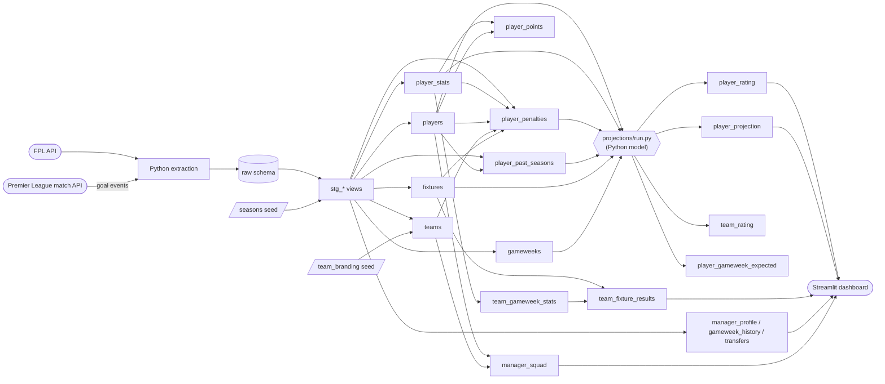
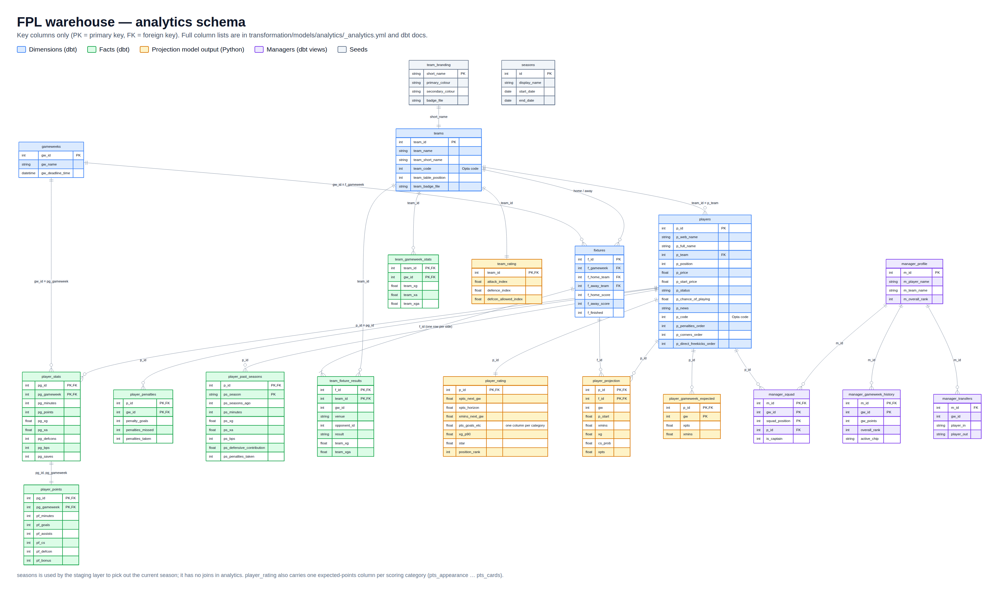
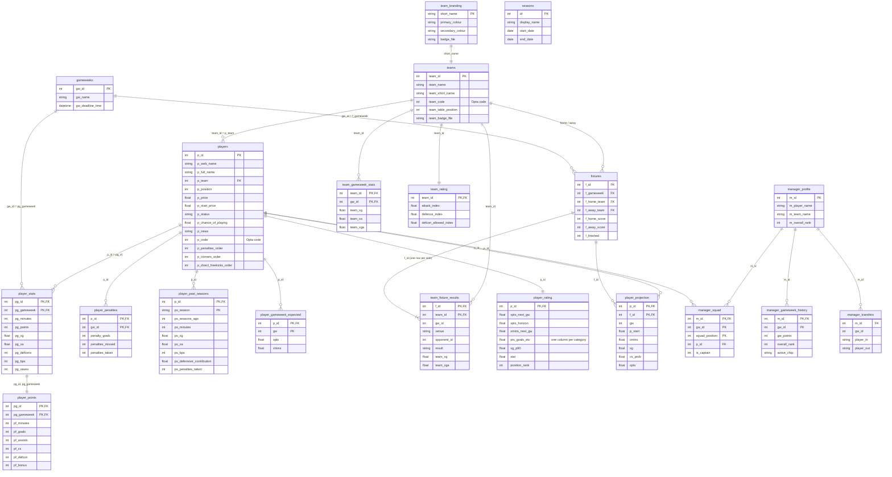

# Data model

The warehouse has three schemas in SQL Server:

| Schema | Built by | Contents |
|---|---|---|
| `raw` | Python extraction + dbt seeds | One table per API dataset, stamped with `season` and `load_timestamp`; the `seasons` and `team_branding` seeds |
| `stg` | dbt (views) | Current season only, renamed and typed |
| `analytics` | dbt (tables; the `manager_*` models are views so managers loaded on demand by the dashboard appear immediately) + `projections/run.py` | Dimensional model consumed by the dashboard, plus the projection model's output (`player_rating`, `player_projection`, `team_rating`) |

## Lineage

## Analytics tables

Columns are prefixed by entity: `p_` players, `ps_` players' previous seasons, `team_` teams, `gw_` gameweeks, `f_` fixtures, `pg_` player-gameweek, `pf_` points-by-category, `m_` managers.

The same diagram as Mermaid source (key columns only):

`player_rating`, `player_projection`, `team_rating` and `player_gameweek_expected` are written by the Python projection model after `dbt build` (see [rating_methodology.md](rating_methodology.md)); it validates its output before replacing the first three in one transaction, and adds each started gameweek's expected points to the fourth. Every dbt model is documented and tested in [`_staging.yml`](../transformation/models/staging/_staging.yml) and [`_analytics.yml`](../transformation/models/analytics/_analytics.yml) (primary-key uniqueness/not-null, relationships and accepted values); `dbt docs generate && dbt docs serve` renders the full catalogue.
